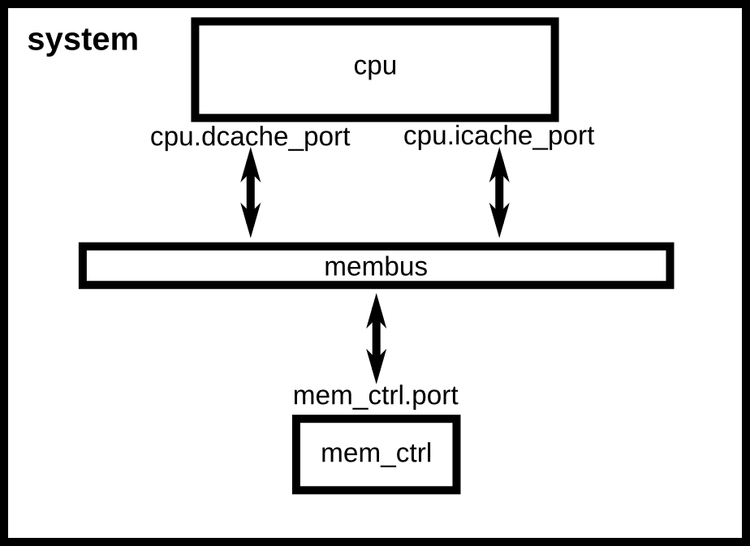
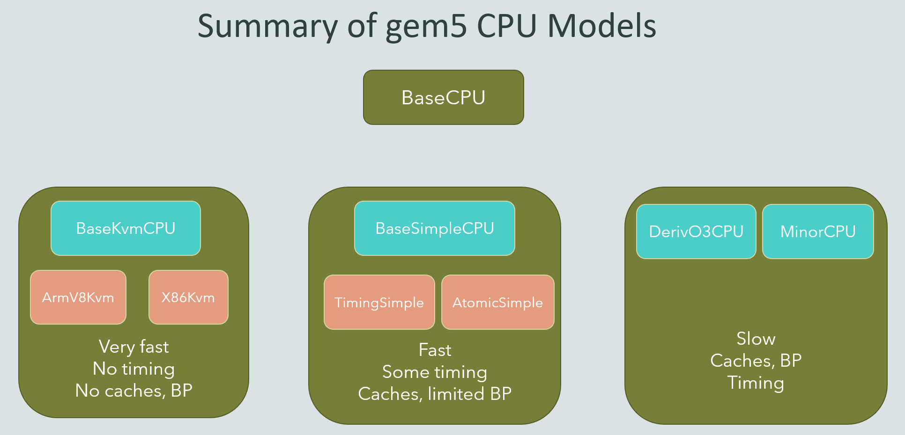
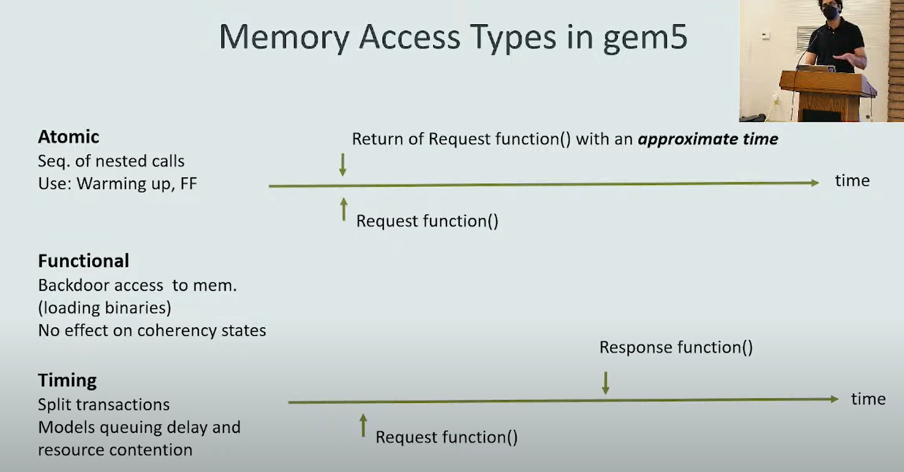

# 安装
- https://www.gem5.org/documentation/general_docs/building
- `lsb_release -a` to check ubuntu version
- after git clone, in gem5/
- don't use virtual env of python because gem5 cannot locate pydot though pydot is installed by pip in venv!!
- `python3.6 -m pip install pydot`
- `python3.6 -m pip install scons`
- python3.6 \`which scons\` build/X86/gem5.opt -j 16
- `scons build/X86/gem5.opt -j16`
  - `scons build/ARM/gem5.opt -j16`
  - `scons build/RSICV/gem5.opt -j16`
  - for different arch

# Learning gem5
## examples
- `build/X86/gem5.opt configs/learning_gem5/part1/simple.py`
  - gem5 输出 Hello world，则 gem5 的安装是成功的
- example1:
  - https://www.gem5.org/documentation/learning_gem5/part1/simple_config/
  - configs/learning_gem5/part1/simple.py
  - 构建了一个最简单的模拟系统, 只有 cpu, membus, memctrl 三个部件
    
- example2:
  - https://www.gem5.org/documentation/learning_gem5/part1/cache_config/
  - cache implement
    - configs/learning_gem5/part1/simple.py
  - adding the cache above to example1:
    - configs/learning_gem5/part1/two_level.py
  - 
  - Adding cache to the configuration script
    
  - **Adding parameters to your script**
    - 为脚本添加参数，即在命令行指定执行的 bin 和 cache 的大小等参数
      ```python
      import argparse

      parser = argparse.ArgumentParser(description='A simple system with 2-level cache.')
      parser.add_argument("binary", default="", nargs="?", type=str,
                          help="Path to the binary to execute.")
      parser.add_argument("--l1i_size",
                          help=f"L1 instruction cache size. Default: 16kB.")
      parser.add_argument("--l1d_size",
                          help="L1 data cache size. Default: Default: 64kB.")
      parser.add_argument("--l2_size",
                          help="L2 cache size. Default: 256kB.")

      options = parser.parse_args()

      # 指定 模拟 的 负载
      system.workload = SEWorkload.init_compatible(options.binary)
      ```
## Understanding gem5 statistics and output
- https://www.gem5.org/documentation/learning_gem5/part1/gem5_stats/
- 一次模拟完成后，m5out 目录下会有至少三个文件
  - config.ini
    - Contains a list of every SimObject created for the simulation and the values for its parameters.
    - The config.ini file is a valuable tool for ensuring that you are simulating what you think you’re simulating.
    - It is a “best-practice” to always check the config.ini as a sanity check that values set in the configuration file are propagated to the actual SimObject instantiation.
  - config.json
    - The same as config.ini, but in json format.
  - stats.txt
    - A text representation of all of the gem5 statistics registered for the simulation.
    - detail: https://www.gem5.org/documentation/general_docs/statistics/
    - 可能会有多个 `---------- Begin Simulation Statistics ----------`。因为在模拟中有多次 dump 或者 存在 checkpoints
## Using the default configuration scripts
  - https://www.gem5.org/documentation/learning_gem5/part1/example_configs/
  - Using se.py and fs.py:
    - `build/X86/gem5.opt configs/deprecated/example/se.py --cmd=tests/test-progs/hello/bin/x86/linux/hello --cpu-type=TimingSimpleCPU --l1d_size=64kB --l1i_size=16kB --caches`
  - 检查 config.ini, 如果有 `.*\[.*cache` 即 cache simObject 生成的话，说明系统中确实有 cache
  - 使用 三级 cache
    - `sudo build/X86/gem5.opt configs/deprecated/example/se.py --cpu-type=X86TimingSimpleCPU --cmd=tests/test-progs/hello/bin/x86/linux/hello --l2cache --l3cache --l1d_size=32kB --l1i_size=32kB --l2_size=1024kB --caches --mem-size=20GB`
## Extending gem5 for ARM
  - https://www.gem5.org/documentation/learning_gem5/part1/extending_configs
  - also the ARM Full System SimulationFS in the link above
## Debugging gem5
  - https://www.gem5.org/documentation/learning_gem5/part2/debugging/
  - `build/X86/gem5.opt --debug-help`
    - See all of the available debug flags, by running gem5 with the `--debug-help` parameter.
  - We can also define our own debug flags
  - `--debug-flags=DRAM`
  - You can control where the debug output goes with the `--debug-file` parameter. By default, all of the debugging output is printed to stdout. However, you can redirect the output to any file. The file is stored relative to the main gem5 output directory, not the current working directory.
  - Debug functions are only **enabled** if you compile gem5 in “opt” or “debug” mode. All other modes use empty placeholder macros for the above functions. Therefore, if you want to use debug flags, you must use either “gem5.opt” or “gem5.debug”.
## Event-driven programming
  - **TODO**
  - https://www.gem5.org/documentation/learning_gem5/part2/events/
## Checkpoints
  - https://www.gem5.org/documentation/general_docs/checkpoints/
  - 保存状态，后续再次加载（暂时用不到）
  - Detailed example: Parsec
    1. Annotate each workload with **start and end of Region of Interest** and with start and end of work units in the program.
    2. Take a checkpoint at the start of the Region of Interest.
    3. Simulate the whole program in the Region of Interest and periodically take checkpoints.
    4. Analyse the statistics corresponding to periodic checkpoints and select the most interesting section of the program execution.
    5. Take warm up cache trace for Ruby before reaching most interesting portion of the program and take the final checkpoint. In each of the following sections we explain each of the above steps in more details.
  - **Due to large simulation time its not always possible to simulate whole program.**
  - The start of the Region of Interest (ROI) is marked by `m5_roi_begin()` and the end of ROI is demarcated by `m5_roi_end()`.
  - 如何使用，见下节
## m5ops
  - https://www.gem5.org/documentation/general_docs/m5ops/
    - https://youtu.be/TeHKMVOWUAY
  - m5ops 包括一些可以直接插入在 源代码 中的函数。使用这些函数需要 include，link
  - `#include "gem5/m5ops.h"`
  - libm5.a 需要先按照网页中的步骤 build
  - `clang++ main.cc -o main -I${GEM5_HOME}/include/ -L${GEM5_HOME}/util/m5/bu
ild/x86/out -lm5 -static`
  - exe 需要在 模拟器 中执行
  - 必须 FS mode ？否
  - 通过实验（in-order）得出结论：
    - gem5 会执行内置pf 指令，并且统计相关的数据
    - 于是 加入 pf 的程序和不加 pf 的程序的性能有非常大的差距
      - 存在 pf 指令的程序增加的 statistics 如下：
``` c++
system.cpu.dcache.SoftPFReq.hits::cpu.data      1081536                       # number of SoftPFReq hits (Count)
system.cpu.dcache.SoftPFReq.hits::total       1081536                       # number of SoftPFReq hits (Count)
system.cpu.dcache.SoftPFReq.misses::cpu.data      1478464                       # number of SoftPFReq misses (Count)
system.cpu.dcache.SoftPFReq.misses::total      1478464                       # number of SoftPFReq misses (Count)
system.cpu.dcache.SoftPFReq.accesses::cpu.data      2560000                       # number of SoftPFReq accesses(hits+misses) (Count)
system.cpu.dcache.SoftPFReq.accesses::total      2560000                       # number of SoftPFReq accesses(hits+misses) (Count)
system.cpu.dcache.SoftPFReq.missRate::cpu.data     0.577525                       # miss rate for SoftPFReq accesses (Ratio)
system.cpu.dcache.SoftPFReq.missRate::total     0.577525                       # miss rate for SoftPFReq accesses (Ratio)
system.cpu.dcache.SoftPFReq.mshrMisses::cpu.data      1352343                       # number of SoftPFReq MSHR misses (Count)
system.cpu.dcache.SoftPFReq.mshrMisses::total      1352343                       # number of SoftPFReq MSHR misses (Count)
system.cpu.dcache.SoftPFReq.mshrMissLatency::cpu.data 111739481703                       # number of SoftPFReq MSHR miss ticks (Tick)
system.cpu.dcache.SoftPFReq.mshrMissLatency::total 111739481703                       # number of SoftPFReq MSHR miss ticks (Tick)
system.cpu.dcache.SoftPFReq.mshrMissRate::cpu.data     0.528259                       # mshr miss rate for SoftPFReq accesses (Ratio)
system.cpu.dcache.SoftPFReq.mshrMissRate::total     0.528259                       # mshr miss rate for SoftPFReq accesses (Ratio)
system.cpu.dcache.SoftPFReq.avgMshrMissLatency::cpu.data 82626.583421                       # average SoftPFReq mshr miss latency ((Tick/Count))
system.cpu.dcache.SoftPFReq.avgMshrMissLatency::total 82626.583421                       # average SoftPFReq mshr miss latency ((Tick/Count))

// 上面的数据对应代码（经过了 indirect memory access prefetch pass）：
constexpr int64_t N = 128 * 10000;
void testFunction(int64_t *sum) {
  for (int64_t i = 0; i < N; ++i) {
    *sum += A[B[i]];
  }
}
可以看到，system.cpu.dcache.SoftPFReq.accesses::cpu.data 正好对应 2*128*10000
```


# CPU models
  - [官方说明](https://www.gem5.org/documentation/general_docs/cpu_models/)
  - [视频讲解](https://www.youtube.com/watch?v=cDv-g-c0XCY&ab_channel=gem5)
  - CPU models in gem5:
    - AtomicSimpleCPU
    - TimingSimpleCPU
    - O3CPU --- (O3 代表 OOO)
    - MinorCPU
    - KvmCPU
  - 继承关系：
    
  - 在了解不同 CPU models 的区别之前，需要知道 gem5 中的 memory access 的区别
    
  - simpleCPU
    - https://www.gem5.org/documentation/general_docs/cpu_models/SimpleCPU
    - functional, in-order
    - AtomicSimpleCPU
      - no resource contentions or queuing delay
      - Mostly used for fast-forwarding and warming of caches
      - 即 访存是瞬间完成的，包括 访存 在内的操作都是 single cycle
      - 一般用于**功能性**的模拟
    - TimingSimpleCPU
      - Execute non-memory operations in one cycle
      - **Models the timing of memory accesses in detail**
  - O3CPU
    - https://www.gem5.org/documentation/general_docs/cpu_models/O3CPU
    - 模拟指令的乱序执行，超标量执行和可执行多核并发的多线程任务。流水线默认为七级。
  - MinorCPU
    - https://www.gem5.org/documentation/general_docs/cpu_models/minor_cpu
    - Minor is an in-order processor model with a fixed pipeline but configurable data structures and execute behaviour.
    - 顺序，流水线
  - KvmCPU
    - Kernel-based virtual machine
    - 即 把一些操作放在 物理机 上运行，从而更高效
    - 存在限制：guest and the host need to have the same ISA
  - **流水线可视化**
    - https://www.gem5.org/documentation/general_docs/cpu_models/visualization/

# GEM5 101
- https://www.gem5.org/documentation/learning_gem5/gem5_101/
- **TODO**: 6 homeworks

# 杂
- 关于 m5_reset_stats 和 m5_dump_stats
  - 若 code 中存在 x 对 reset+dump，则最终 stats.txt 中会有 x+1 个statistics, 具体意义如下：
```c++
code segment1
reset()
code segment2
dump()
code segment3
return

那么，stats.txt 中会有两个 statistics 区间
第一个，为 2
第二个，为 3
  即，程序最后会有一次默认的 dump
1 并未被统计
```
  - reset 和 dump 的两个参数的意义尚不明了
- work begin 和 work end
  - 这对函数并不会增加 stat 区间，不好用！
- https://stackoverflow.com/questions/56531233/instrumenting-roi-in-gem5-se-mode
- https://stackoverflow.com/questions/48944587/how-to-count-the-number-of-cpu-clock-cycles-between-the-start-and-end-of-a-bench/48944588#48944588
- 

# FS sim
- 完全参考 https://blog.csdn.net/weixin_49908714/article/details/130824680
- `./build/X86/gem5.opt configs/deprecated/example/fs.py --ruby --network=garnet --kernel=x86-linux-kernel-5.4.49 --disk=x86-ubuntu.img --script=./readfile`
- 然后在另一个终端，`~/gem5/util/term$ ./m5term localhost 3456`
- `3456` 根据命令 1 得到：`system.pc.com_1.device: Listening for connections on port 3456`